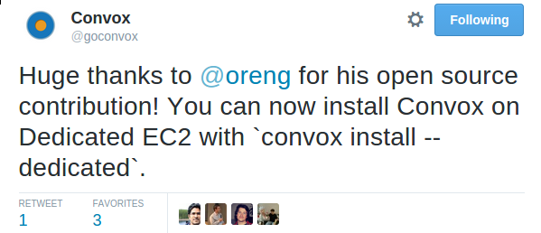

## Your own Heroku in 5 minutes

[Convox](http://www.convox.com) is an open source project started by 3 ex-heroku engineers with the goal of having your own Heroku-like setup running on AWS. It follows the [12 factor app](http://12factor.net) that not surprisingly was written by one of Heroku's founders.

Let's get started. Install the cli (called convox) and than run `convox install`. 5 minutes later and you get something like this:


That's all you need to run your your apps and services. Let's deploy a ruby web app with redis and postgres:
```
git clone git@github.com:convox-examples/sinatra.git
cd sinatra
convox apps create
convox deploy
```
After a minute you'll see a url of your new app. You can point your DNS to this host to have app.my-server.com
Here is what happend behind the scenes:


Deploying a new version is just a matter of running the  `deploy` again.
It will gzip the folder to your cluster, build an image, upload it to it's private docker registry (stored on S3), pull the image and run it on an EC2 and gracefully shutdown the old containers.

What if you want to scale your app and have it running on 5 instances?
```
convox scale --count 5
```

The beauty of Cronox is it's usage of battle tested building blocks - instead of using Fleet, Etcd and custom schedulers it uses EC2, S3, ELB, Auto Scaling group, EC2 Container Service, DynamoDB and other familiar friends.

A good indicator of a healty open source project is the speed it takes to ramp up new contributers and the friendliness of it's community.
It took me a few hours to add support for dedicated EC2, a requiremnt for [HIPAA](https://en.wikipedia.org/wiki/Health_Insurance_Portability_and_Accountability_Act) 



And hanks [Cyril](https://twitter.com/cyx) for telling me about this project and destroying my weekend!