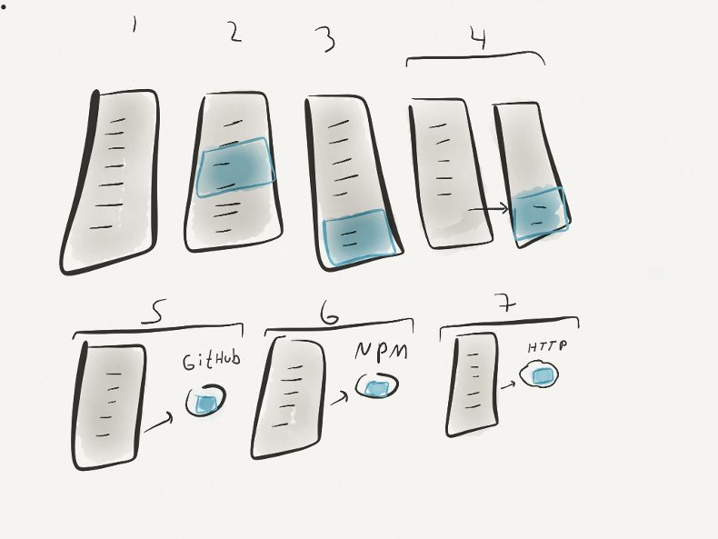

# Evolution of a Microservice

1. Write code
1. Detect a need for a function
1. Move it around to make the code more readable
1. Create a CommonJS module (require that file)
1. Move the function to it's own Git repo
1. Publish to NPM
1. Put it behind HTTP Service

Most of the time you don't continue beyond step 4. If the function needs to be shared with other projects, move it to it's own Git repo. Do you need semantic versioning? publish it to NPM. Do you want to consume it over HTTP? set up an HTTP service in front of it.
